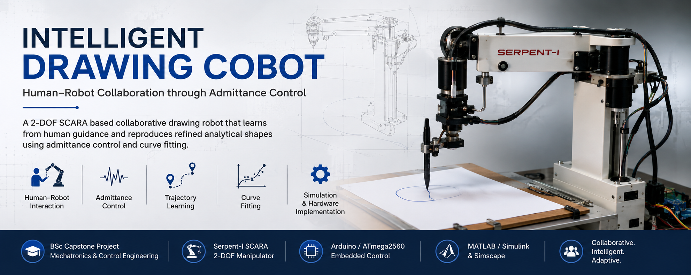
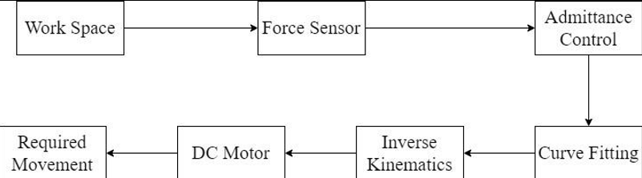
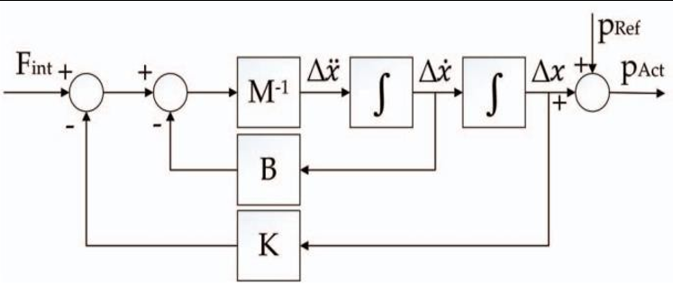
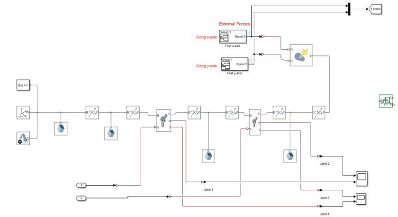
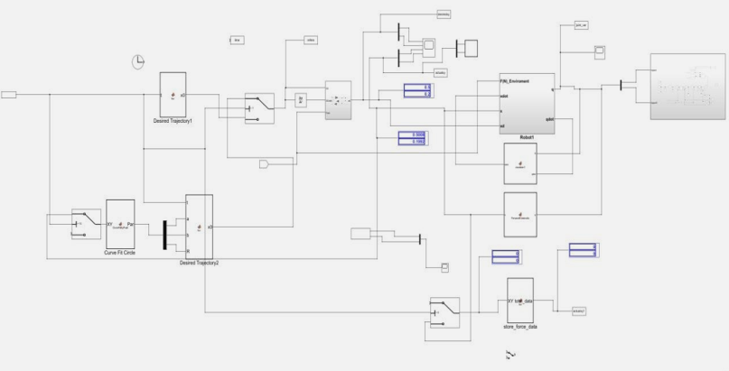
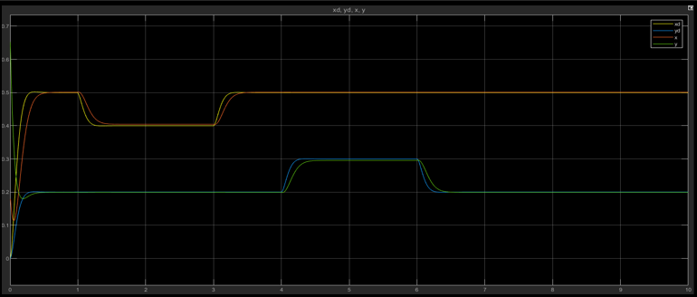
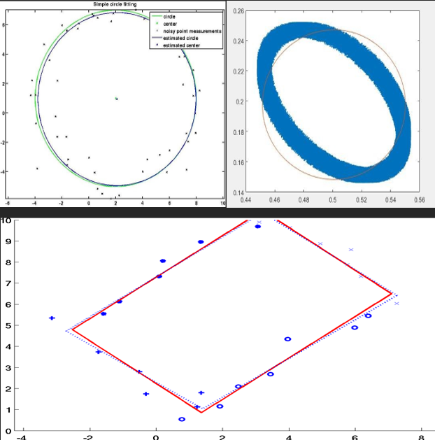
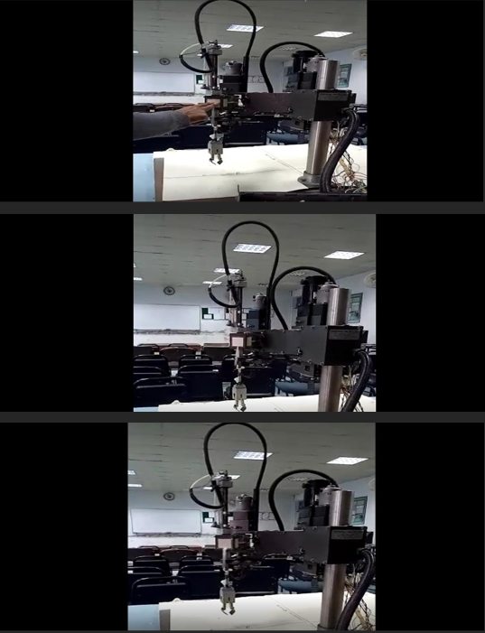

# Intelligent Drawing Cobot

<p align="center">
  
</p>

A collaborative robotic drawing system developed as a BSc Mechatronics & Control Engineering capstone project at the University of Engineering & Technology (UET), Lahore.

The project investigates **human–robot interaction using admittance control**, allowing a user to physically guide a robotic manipulator through a desired trajectory. The demonstrated trajectory can then be processed using **curve fitting** and reproduced by the robot as a refined analytical shape.

## Project Overview

The Intelligent Drawing Cobot was developed using the **Serpent-I SCARA robotic manipulator** configured as a two-degree-of-freedom (2-DOF) planar system.

The system combines:

- Admittance control for human–robot interaction
- Forward and inverse kinematics
- Force-sensitive input
- Encoder-based position feedback
- PID position control
- Curve fitting for trajectory refinement
- Arduino-based embedded control
- MATLAB/Simulink and Simscape simulation
- Physical robotic hardware implementation

The overall objective was to demonstrate a simple **learning-by-demonstration approach**, where a user guides the robot along a trajectory and the system subsequently reproduces a refined version of the intended shape.

## System Architecture

The Intelligent Drawing Cobot was developed around a **2-DOF planar robotic manipulator** designed to support physical human–robot interaction and trajectory learning.

The system follows a learning-by-demonstration approach in which force applied by the user is interpreted through the admittance-control framework and converted into commanded manipulator motion. Position and force measurements provide feedback during interaction, while the demonstrated trajectory can subsequently be processed using curve fitting to obtain a refined path for autonomous reproduction.

The overall workflow therefore connects **human input, sensing, robotic motion, trajectory acquisition, curve fitting, and automated trajectory reproduction**.

### Project Workflow

<p align="center">
  
</p>

<p align="center">
  <i>Figure 1. Overall workflow of the Intelligent Drawing Cobot, from physical human input to trajectory processing and robotic reproduction.</i>
</p>

The architecture was designed to allow a user to demonstrate a task through physical interaction rather than requiring the complete trajectory to be programmed manually. The demonstrated motion provides the basis for generating a refined trajectory that can subsequently be reproduced by the manipulator.

## Control Methodology

The control framework combined **admittance control, robotic kinematics, and closed-loop position control** to translate physical human interaction into controlled manipulator motion.

In the admittance-control approach, force applied by the user acts as the input to the system, while the resulting motion of the manipulator forms the response. The desired displacement is determined according to the selected virtual mechanical characteristics, including stiffness and damping, allowing the robot to respond compliantly to external interaction.

### Admittance Control Architecture

<p align="center">
  
</p>

<p align="center">
  <i>Figure 2. Admittance-control architecture used to translate physical force input into commanded manipulator motion.</i>
</p>

The resulting Cartesian-space motion commands were converted into joint-space variables using **inverse kinematics**. Position feedback from the manipulator was then used within a **PID-based position-control loop** to drive the joints towards the required positions.

This created a closed interaction loop in which sensor measurements, admittance behaviour, kinematic transformations, and motor control worked together to produce controlled motion in response to user-applied force.

## Simulation

Before implementation on the physical manipulator, the control approach was evaluated using **MATLAB/Simulink and Simscape**. A two-degree-of-freedom robotic manipulator was modelled to represent the motion of the physical system and evaluate its response under the proposed control framework.

The simulation integrated the robot dynamics with the admittance and position-control stages, allowing commanded and desired motion to be examined before application to the hardware.

### 2-DOF Simscape Manipulator

<p align="center">
  
</p>

<p align="center">
  <i>Figure 3. Two-degree-of-freedom robotic manipulator model developed in Simscape.</i>
</p>

The Simscape implementation provided a physical representation of the two-link manipulator using revolute joints. Joint position and velocity information generated by the robot-dynamics model could therefore be translated into simulated physical movement of the manipulator.

### Complete Simulink Control Model

<p align="center">
  
</p>

<p align="center">
  <i>Figure 4. Complete Simulink implementation integrating admittance control with the robotic manipulator model.</i>
</p>

The complete simulation connected the desired trajectory, admittance-control calculations, kinematic transformations, robot dynamics, and manipulator response. This provided an environment for evaluating the interaction between the control algorithm and the robotic system before physical implementation.

### Admittance-Control Response

<p align="center">
  
</p>

<p align="center">
  <i>Figure 5. Simulation response obtained from the admittance-control implementation.</i>
</p>

The simulation demonstrated the manipulator responding to externally applied forces while following the motion generated through the control framework. The resulting response provided a basis for evaluating the proposed approach before progressing to experimental implementation on the physical robot.

## Hardware Implementation

The physical implementation was based on the **Serpent-I robotic manipulator**, configured as a two-degree-of-freedom planar system for collaborative drawing experiments.

The embedded control system used an **Arduino Mega 2560 (ATmega2560)** to acquire sensor measurements and generate commands for the manipulator. Force-sensitive resistors provided information about physical interaction with the user, while encoder feedback was used to determine the position of the robotic joints.

### Hardware & Embedded Control

Key components of the experimental system included:

* Serpent-I robotic manipulator
* Arduino Mega 2560 / ATmega2560
* DC motors and motor drivers
* Force-sensitive resistors (FSRs)
* Joint-position encoders
* Limit switches
* Embedded motor-control routines
* Mechanical drawing end-effector

Sensor measurements were sampled and processed before being passed through the control calculations. The resulting desired motion was converted into joint-space commands and ultimately into PWM signals for motor actuation.

Safety constraints were also incorporated into the controller to limit command values before they were applied to the motors and associated drive electronics.

The physical platform provided the experimental basis for evaluating how user-applied force could produce controlled manipulator displacement and how the robot behaved when returning towards its reference position.

## Results

The project evaluated the proposed collaborative drawing approach through both **simulation and physical hardware experiments**. The results demonstrated the relationship between human-guided motion, trajectory processing, and subsequent robotic reproduction of the intended shape.

### Shape Learning & Curve Fitting

<p align="center">
  
</p>

<p align="center">
  <i>Figure 6. Shape-learning and curve-fitting results demonstrating the processing of user-guided trajectories into refined geometric paths.</i>
</p>

User-guided trajectories generated through physical interaction were processed using curve-fitting techniques to obtain cleaner analytical representations of the intended shapes. The project investigated this approach using geometric trajectories including **circular and rectangular paths**.

This demonstrated the learning-by-demonstration concept at the centre of the project: rather than requiring every trajectory to be manually programmed, a path could first be demonstrated through interaction, processed computationally, and subsequently used as a reference for robotic reproduction.

### Physical Hardware Testing

<p align="center">
  
</p>

<p align="center">
  <i>Figure 7. Physical hardware experiments demonstrating force application, manipulator displacement, and return towards the reference position.</i>
</p>

Physical testing demonstrated the response of the manipulator to externally applied force. The hardware experiments examined the displacement produced by physical interaction and the subsequent behaviour of the manipulator as it returned towards its reference position.

Together with the simulation and curve-fitting results, these experiments demonstrated the integration of **human–robot interaction, compliant motion control, trajectory processing, and physical robotic actuation** within the developed system.

## My Contributions

This project was completed as part of a **three-member capstone team**, with responsibilities distributed across mechanical/hardware development, embedded programming, simulation, and technical documentation.

My primary contributions focused on the **physical implementation and technical documentation** of the project, including:

* Hardware wiring and integration of the robotic system
* Mechanical assembly of the manipulator and associated components
* Support during initial hardware testing and experimental development
* Practical work with the physical robotic platform and mechanical components
* Supporting contributions to Arduino-based implementation
* Preparation, organisation, and technical editing of the final project report
* Integration of technical material, experimental results, diagrams, and team contributions into a structured engineering document

Physical development of the project was significantly affected by **COVID-19 restrictions**, which prevented continued access to the university laboratory and robotic hardware. Following discussions with the academic supervisors, the project therefore placed greater emphasis on simulation and software-based development during the remaining project period.

Within the team, the simulation and Simulink modelling were primarily developed by another team member, while another member led much of the Arduino programming. My role remained concentrated on the **hardware/mechanical implementation, early physical testing, supporting embedded work, and technical documentation**.

This multidisciplinary project provided practical experience in integrating mechanical, electronic, embedded, and software components within a collaborative robotics application.

## Technologies & Engineering Concepts

### Software & Embedded Systems

* MATLAB
* Simulink
* Simscape
* Arduino / ATmega2560
* Embedded Programming

### Robotics & Control

* Admittance Control
* PID Position Control
* Forward & Inverse Kinematics
* Robot Dynamics
* Trajectory Generation
* Curve Fitting

### Hardware & Integration

* Mechanical Assembly
* Hardware Wiring & Integration
* Force-Sensitive Resistors (FSRs)
* Encoder Feedback
* DC Motor Actuation
* Sensor Integration
* Human–Robot Interaction


## Repository Structure

```text
Intelligent-Drawing-Cobot/
│
├── README.md
│
├── docs/
│   └── final-project-report.pdf
│
└── images/
    ├── cobot_banner.png
    ├── 01_project_workflow.png
    ├── 02_admittance_control_architecture.png
    ├── 03_simscape_robot_model.png
    ├── 04_simulink_control_model.png
    ├── 05_admittance_simulation_result.png
    ├── 06_shape_curve_fitting.png
    └── 07_hardware_testing.png

```

## Academic & Project Context

| Category | Details |
|---|---|
| **Degree** | Bachelor of Mechatronics & Control Engineering |
| **University** | University of Engineering & Technology (UET), Lahore |
| **Project Type** | Final-Year Capstone Project |
| **Project** | Intelligent Drawing Cobot |
| **Team Size** | 3 Members |
| **Project Advisor** | Dr. Abbas Zulqarnain |

This repository presents the project as a **team-based academic engineering project**. Individual responsibilities are described separately in the **My Contributions** section above.

